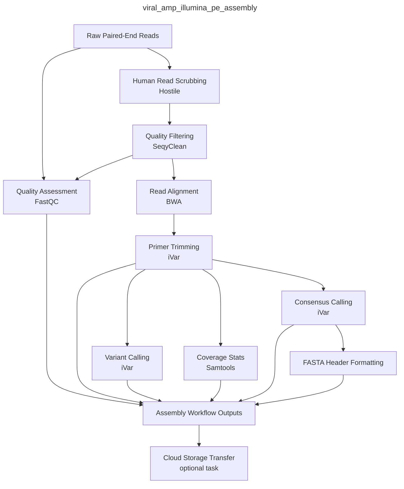
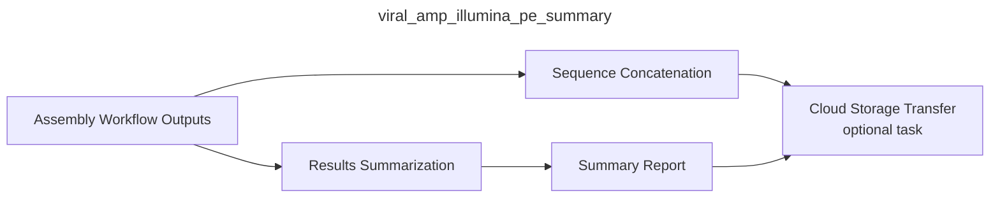
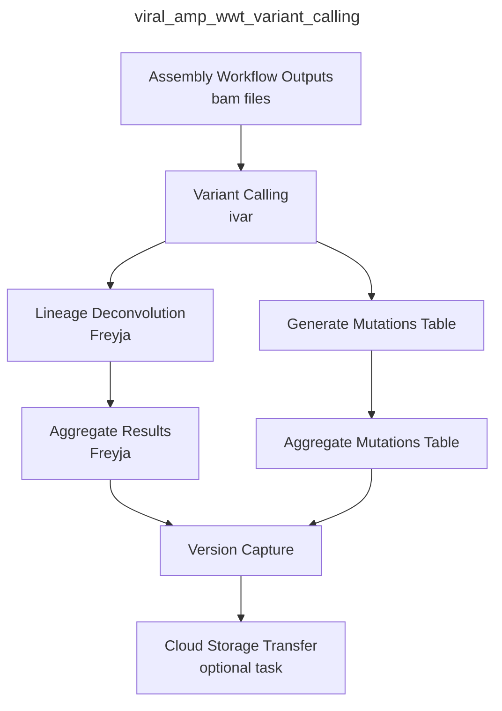

# CDPHE_Viral_Amp_WDL Workflows

## Disclaimer
**Next generation sequencing and bioinformatic and genomic analysis at the Colorado Department of Public Health and Environment (CDPHE) is not CLIA validated at this time. These workflows and their outputs are not to be used for diagnostic purposes and should only be used for public health action and surveillance purposes. CDPHE is not responsible for the incorrect or inappropriate use of these workflows or their results.**

 

## Overview

The following documentation describes the Colorado Department of Public Health and Environment's workflows for the assembly and analysis of viral amplicon whole genome and targeted sequencing data on GCP's Terra.bio platform. Workflows are written in WDL and can be imported into a Terra.bio workspace through dockstore (see Setup section below: https://dockstore.org/).

Our viral reference-based assembly workflows are highly adaptable and facilitate the assembly and analysis of tiled amplicon based sequencing data of viral samples. The workflows can accommodate various amplicon primer schemes sequenced using Illumina paired-end sequencing. These workflows can be applied to both (1) whole-genome tiled amplicon approaches and (2) targeted sequencing approaches using known primer locations to amplify specific regions of the viral genome.

 

## Available Workflows

 

|Workflow Name | Description |
|--------------|-------------|
| ``viral_amp_illumina_pe_assembly`` | Performs reference-based assembly of viral genomes or targeted regions from Illumina paired-end amplicon data. |
| ``viral_amp_illumina_pe_summary`` | Generates summary statistics and quality metrics from assembled viral genomes or targeted regions. |
| ``viral_amp_wwt_variant_calling`` | Uses Freyja to estimate relative lineage abundances and variant composition from wastewater samples. |

## viral_amp_illumina_pe_assembly

File: viral_amp_illumina_pe_assembly.wdl

This workflow was developed for the assembly of Illumina 150 bp paired-end read data using the Illumina Nextera XT library prep protocol. The workflow accepts "sample" as the root entity type. The workflow will:

1. Perform human read scrubbing on the fastq files using [hostile](https://github.com/bede/hostile) if `scrub_reads` is set to true.
2. Use Seqyclean to quality filter and trim raw fastq files
    - Seqyclean parameters include a minimum read length set to 70 bp and quality trimming set to a minimum Phred quality score of 30.
3. Run FastQC on both the raw and cleaned reads
4. Align reads to the reference genome using bwa and then sort the bam by coordinates using Samtools
5. Use iVar trim to trim primer regions and then sort the trimmed bam by coordinates using Samtools
6. Use iVar variants to call variants from the trimmed and sorted bam
   - iVar variants parameters include a minimum quality score set to 20, a minimum variant base frequency set to 0.6 and a minimum read depth set to 10.
7. Use iVar consensus to call the consensus genome sequence from the trimmed and sorted bam
   - iVar consensus parameters include a minimum quality score set to 20, a minimum variant base frequency set to 0.6 and a minimum read depth set to 10.
8. Use Samtools flagstat, stats, and coverage to output statistics from the bam
9. Rename the fasta header of consensus sequences in the GISAID-acceptable format: CO-CDPHE-{sample_id}

### Inputs

#### 1. Terra Data Table

The terra data table must include the following columns as listed below. Note that optional columns are not necessary for the assembly workflow but must be present for the SC2_lineage_calling_and results.wdl and Transfer workflows described below under `Lineage Calling Workflows` and `Transfer Workflows`, respectively.

| column header      | description                                                                                      |
| ------------------ | ------------------------------------------------------------------------------------------------ |
| `entity:sample_id` | column with the list of sample names. (e.g. `entity:test-measles-0005-miseq_id`)                             |
| `fastq_1`          | The google bucket path to the R1 fastq file.                                                     |
| `fastq_2`          | The google bucket path to the R2 fastq file.                                                     |
| `out_dir`          | User defined google bucket for where the files will be transferred during the transfer workflows. |
| `workbook_path`    | (optional; required for lineage calling workflow)                                                |
| `project_name`     | (optional; required for lineage calling workflow)                                                |

#### 2. Terra Workspace Data

See [setup](setup.md).

#### 3. Setting Up the Workflow Inputs

For setting up the workflow inputs, use the `viral_amp_braz_illumina_pe_assembly.json` for N450 samples and `viral_amp_imap_illumina_pe_assembly.json` for WGS samples, in the `inputs` directory.

| workflow variable           | attribute (input syntax into workflow)   |
| --------------------------- | ---------------------------------------- |
| `contam_fasta`              | workspace.adapters_and_contaminants      |
| `analysis_date`             | this.run_date                            |
| `viral_amp_ref_fasta`       | workspace.viral_amp_*_ref_fasta          |
| `viral_amp_ref_gff`         | workspace.viral_amp_*_ref_gff            |
| `fastq_1`                   | this.fastq_1                             |
| `fastq_2`                   | this.fastq_2                             |
| `out_dir`                   | this.out_dir                             |
| `overwrite`                 | `true` or `false`                        |
| `viral_amp_primer_bed`      | workspace.viral_amp_*_primer_bed      |
| `project_name`              | this.project_name                        |
| `sample_name`               | this.{entity_name}\_id                   |
| `scrub_reads`               | `true` or `false`                        |
| `scrub_genome_index`        | workspace.hostile_human_t2t_hla_bt2 (if using read scrubbing)  |

### Outputs

| WDL task name            | software/program                           | variable name                | description                                                                                                             |
| ------------------------ | ------------------------------------------ | ---------------------------- | ----------------------------------------------------------------------------------------------------------------------- |
| hostile                  | hostile                                    | `human_reads_removed`      | integer                                                                                                                   |
| hostile                  | hostile                                    | `human_reads_removed_proportion` | floating-point number                                                                                               |
| hostile                  | hostile                                    | `fastq1_scrubbed`          | file
| hostile                  | hostile                                    | `fastq2_scrubbed`          | file
| seqyclean                | seqyclean                                  | `filtered_reads_1`         | file                                                                                                                    |
| seqyclean                | seqyclean                                  | `filtered_reads_2`         | file                                                                                                                    |
| seqyclean                | seqyclean                                  | `seqyclean_summary`        | file                                                                                                                    |
| fastqc as fastqc_raw     | fastqc                                     | `fastqc_raw1_html`         | file                                                                                                                    |
| fastqc as fastqc_raw     | fastqc                                     | `fastqc_raw1_zip`          | file                                                                                                                    |
| fastqc as fastqc_raw     | fastqc                                     | `fastqc_raw2_html`         | file                                                                                                                    |
| fastqc as fastqc_raw     | fastqc                                     | `fastqc_raw2_zip`          | file                                                                                                                    |
| fastqc as fastqc_cleaned | fastqc                                     | `fastqc_clean1_html`       | file                                                                                                                    |
| fastqc as fastqc_cleaned | fastqc                                     | `fastqc_clean1_zip`        | file                                                                                                                    |
| fastqc as fastqc_cleaned | fastqc                                     | `fastqc_clean2_html`       | file                                                                                                                    |
| fastqc as fastqc_cleaned | fastqc                                     | `fastqc_clean2_zip`        | file                                                                                                                    |
| align_reads              | bwa and samtools                           | `out_bam`                  | file                                                                                                                    |
| align_reads              | bwa and samtools                           | `out_bamindex`             | file                                                                                                                    |
| ivar trim                | ivar trim and samtools                     | `trim_bam`                 | file                                                                                                                    |
| ivar trim                | ivar trim and samtools                     | `trimsort_bam`             | file                                                                                                                    |
| ivar trim                | ivar trim and samtools                     | `trimsort_bamindex`        | file                                                                                                                    |
| ivar variants            | ivar variants                              | `variants`                 | vcf file formatted as a tsv                                                                                             |
| ivar consensus           | ivar consensus                             | `consensus`                | fasta file of consensus genome, Ns are called in places with less than 10 bp read depth.                                |
| bam_stats                | samtools flagstat, stats, percent_coverage | `flagstat_out`             | file                                                                                                                    |
| bam_stats                | samtools flagstat, stats, percent_coverage | `stats_out`                | file                                                                                                                    |
| bam_stats                | samtools flagstat, stats, percent_coverage | `covhist_out`              | file                                                                                                                    |
| bam_stats                | samtools flagstat, stats, percent_coverage | `cov_out`                  | file                                                                                                                    |                                                        
| rename_fasta             | N/A                                        | `renamed_consensus`        | fasta file; consensus genome sequence with the fasta header renamed to be CO-CDPHE-{sample_name}                        |
| version_capture          | version_capture.py                         | `version_capture_file` |  file                                                                                                    |
| transfer                 | gsutil                                     | `transfer_date_assembly`   | String                                                                                                                  |
|

## Process

### Viral sequence assembly and variant calling
Processing of viral sequencing data involves two coordinated workflows (Figure 1). When analyzing wastewater samples, processing of viral sequencing data involves two coordinated workflows (Figure 1). The first, ``viral_amp_illumina_pe_assembly``, takes raw paired-end Illumina reads and performs quality control, contamination filtering, primer trimming, reference-guided assembly, variant calling, and consensus genome generation. Intermediate files and consensus sequences are then transferred to a designated Google Cloud bucket(GCP) for storage and downstream access (optional).

Next, the ``viral_amp_illumina_pe_summary`` workflow aggregates the outputs from multiple samples, concatenates consensus sequences, and generates a comprehensive sequencing results report (including coverage metrics), while also organizing the outputs into a versioned results directory.

Finally, if wastewater samples are being analyzed, the ``viral_amp_wwt_variant_calling workflow`` applies Freyja to estimate relative lineage abundances in wastewater samples, accounting for the mixed nature of viral populations present. 

## Setup

 

### Input Workflow from Dockstore
To use the workflow on the Terra platform, first you will need to import the workflow from Dockstore. All workflows can be found under our dockstore organization called CDPHE-bioinformatics.
1. Go to dockstore (https://dockstore.org/).
2. Along the top search bar click on Organizations and search for "CDPHE".
3. Select the workflow.
4. On the right hand side of the workflow description, select "Launch with Terra".
5. Select the Destination workspace and select "Import". 
6. The workflow will now be displayed as a card under your workflows tab in your Terra workspace. 

 

### Workspace Data
Prior to running any of the workflows, you must set up the Terra workspace data with the correct reference files and custom python scripts. Python scripts can be found in the ``scripts`` directory. Workspace variables are named using the following format ``{organism}_{description}_{file_type}``, except for the primer bed files which are named as ``{description}_{file_type}``. Reference files and python scripts should be copied from this repo into a GCP bucket. The GCP bucket path to the file will serve as the "value" when adding data to the terra workspace data table. Alternatively, reference files and scripts can be uploaded and saved as workspace files on Terra.bio, and the backend Terra.bio GCP bucket address can be used.

To add data to the terra workspace data:
1. Navigate to the Data tab in your Terra workspace.
2. In the left hand list of data tables, under "Other Data" select "Workspace Data".
3. Click on the "+" button in the lower right hand corner of the workspace data table. 
4. Fill in the "Key" column with the workspace variable name, the "Value" column with GCP bucket path to the file and the "Description" column with a brief description if desired. 
5. Once complete hit the check mark to the right.

Below is a data table detailing the workspace data you will need to set up in order to run the Viral workflows. 

| workspace variable name | workflow | file name | description |
|-------------------------|------------|----------------|-----------------|
| ``adapters_and_contaminants`` | ``viral_amp_illumina_pe_assembly`` | Adapters_plus_PhiX_174.fasta | Adapters and PhiX contaminant sequences removed during FASTQ cleaning and filtering using SeqyClean. Thanks to Erin Young at Utah Public Health Laboratory for providing this file! |
| ``calc_percent_coverage_py`` | ``viral_amp_illumina_pe_assembly`` | calc_percent_coverage.py | Python script used in the Viral Amplicon assembly workflow to calculate percent genome coverage from consensus sequences. |
| ``<your_primers_bed>`` | ``viral_amp_illumina_pe_assembly`` | <your_primers>.bed | Primer BED file for the amplicon set used during genome or targeted assembly. |
| ``<your_ref>_fasta`` | ``viral_amp_illumina_pe_assembly`` | <your_ref>.fasta | Reference genome FASTA that correpsonds to your primer bed file to use for read mapping. |
| ``<your_ref>_gff`` | ``viral_amp_illumina_pe_assembly`` | <your_ref>.gff | Genome annotation file (GFF) corresponding to the reference fasta used for viral amplicon assembly. If you are running the wastewater workflow. This reference fasta need to match the reference used by Freyja. |
| ``viral_amp_concat_seq_results_py`` | ``viral_amp_illumina_pe_assembly`` | concat_seq_results.py | Python script used to concatenate sequence metrics and results from the Viral Amplicon assembly workflow. |
| ``viral_amp_version_capture_py`` | ``viral_amp_illumina_pe_assembly`` | version_capture.py | Generates version capture output files for documenting software versions used in the assembly workflow. |
| ``viral_amp_version_capture_variant_calling_py`` | ``viral_amp_variant_calling`` | version_capture_viral_amp_variant_calling.py | Generates version capture output files for documenting software versions used in the variant calling workflow. |
