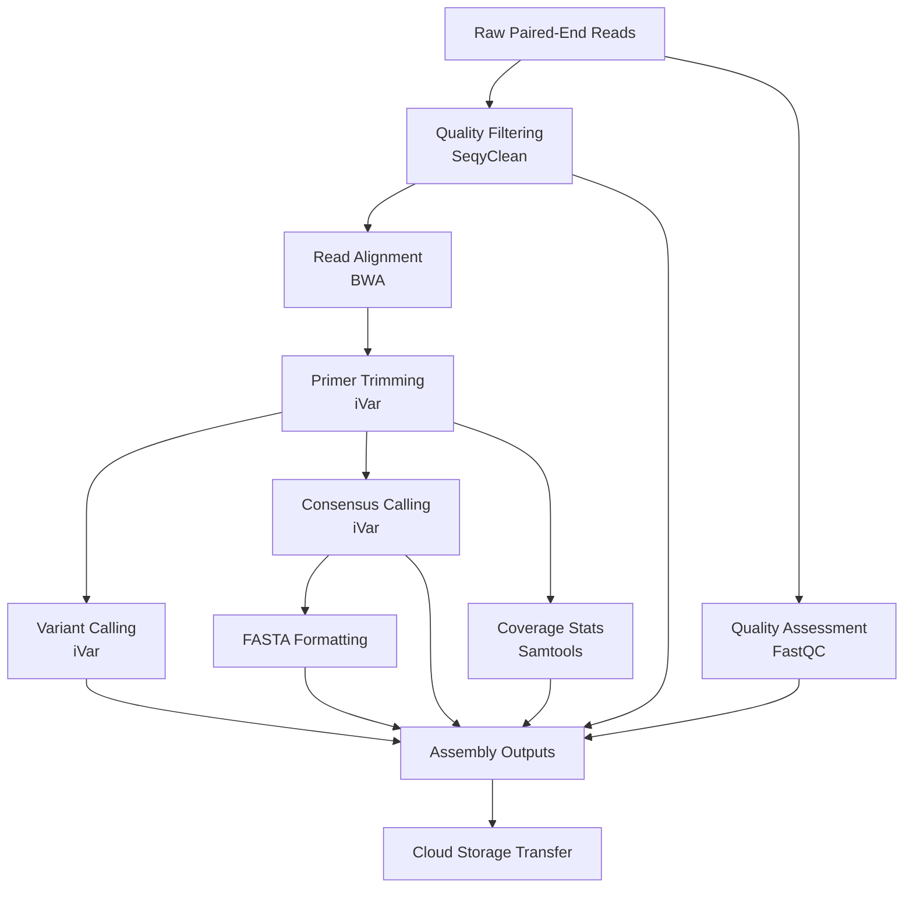
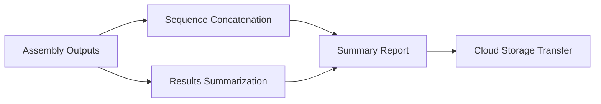
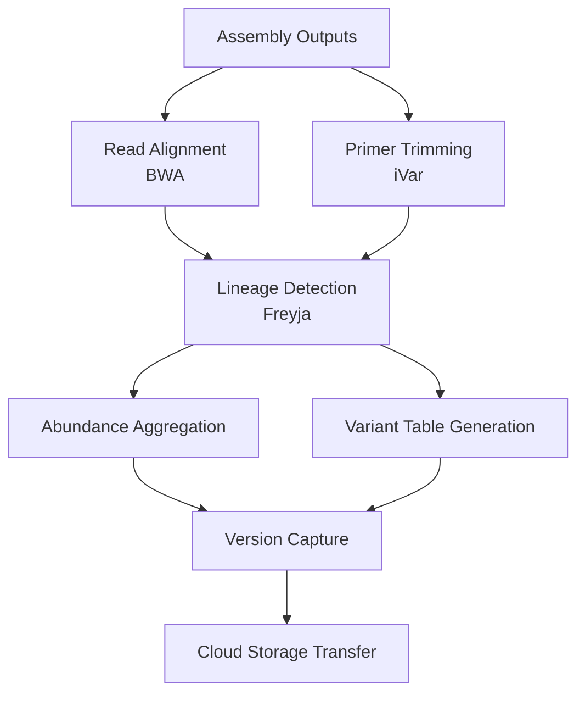

# CDPHE_Viral_Amp_WDL Workflows

## Disclaimer
**Next generation sequencing and bioinformatic and genomic analysis at the Colorado Department of Public Health and Environment (CDPHE) is not CLIA validated at this time. These workflows and their outputs are not to be used for diagnostic purposes and should only be used for public health action and surveillance purposes. CDPHE is not responsible for the incorrect or inappropriate use of these workflows or their results.**

 

## Overview

The following documentation describes the Colorado Department of Public Health and Environment's workflows for the assembly and analysis of whole genome sequencing data of Viral Amplicon on GCP's Terra.bio platform. Workflows are written in WDL and can be imported into a Terra.bio workspace through dockstore (see Setup section below: https://dockstore.org/).

Our Viral whole genome reference-based assembly workflows are highly adaptable and facilitate the assembly and analysis of tiled amplicon based sequencing data of Viral samples. The workflows can accommodate various amplicon primer schemes including Artic V1 and Measles (BRAZ/WHO), as well as different sequencing technology platforms such as Illumina. These workflows can be applied to both (1) whole-genome tiled amplicon approaches and (2) targeted sequencing approaches using known primer locations to amplify specific regions of the viral genome.

 

## Available Workflows

 

|Workflow Name | Description |
|--------------|-------------|
| ``viral_amp_illumina_pe_assembly`` | Performs reference-based assembly of viral genomes from Illumina paired-end amplicon data. |
| ``viral_amp_illumina_pe_summary`` | Generates summary statistics and quality metrics from assembled viral genomes. |
| ``viral_amp_wwt_variant_calling`` | Uses Freyja to estimate relative lineage abundances and variant composition from mixed viral samples (e.g., wastewater). |

## Process

### Wastewater Viral sequence assembly and variant calling
Processing of wastewater viral sequencing data involves three coordinated workflows (Figure 1). The first, ``viral_amp_illumina_pe_assembly``, takes raw paired-end Illumina reads and performs quality control, contamination filtering, primer trimming, reference-guided assembly, variant calling, and consensus genome generation. Intermediate files and consensus sequences are then transferred to a designated Google Cloud bucket(GCP) for storage and downstream access.

Next, the ``viral_amp_illumina_pe_summary`` workflow aggregates the outputs from multiple samples, concatenates consensus sequences, and generates a comprehensive sequencing results report (including coverage statistics and clade assignments), while also organizing the outputs into a versioned results directory.

Finally, the ``viral_amp_wwt_variant_calling workflow`` applies Freyja to estimate relative lineage abundances in wastewater samples, accounting for the mixed nature of viral populations present. 

## Setup

 

### Input Workflow from Dockstore
To use the workflow on the Terra platform, first you will need to import the workflow from Dockstore. All workflows can be found under our dockstore organization called CDPHE-bioinformatics.
1. Go to dockstore (https://dockstore.org/).
2. Along the top search bar click on Organizations and search for "CDPHE".
3. Select the workflow.
4. On the right hand side of the workflow description, select "Launch with Terra".
5. Select the Destination workspace and select "Import". 
6. The workflow will now be displayed as a card under your workflows tab in your Terra workspace. 

 

### Workspace Data
Prior to running any of the workflows, you must set up the Terra workspace data with the correct reference files and custom python scripts. The reference files can be found in this repository in the ``data/workspace_data`` directory. Python scripts can be found in the ``scripts`` directory. Workspace variables are named using the following format ``{organism}_{description}_{file_type}``, except for the primer bed files which are named as ``{description}_{file_type}``. Reference files and python scripts should be copied from this repo into a GCP bucket. The GCP bucket path to the file will serve as the "value" when adding data to the terra workspace data table. 

To add data to the terra workspace data:
1. Navigate to the Data tab in your Terra workspace.
2. In the left hand list of data tables, under "Other Data" select "Workspace Data".
3. Click on the "+" button in the lower right hand corner of the workspace data table. 
4. Fill in the "Key" column with the workspace variable name, the "Value" column with GCP bucket path to the file and the "Description" column with a brief description if desired. 
5. Once complete hit the check mark to the right.

Below is a data table detailing the workspace data you will need to set up in order to run the Viral workflows. 

| workspace variable name | workflow | file name | description |
|-------------------------|------------|----------------|-----------------|
| ``adapters_and_contaminants`` | ``viral_amp_illumina_pe_assembly`` | Adapters_plus_PhiX_174.fasta | Adapters and PhiX contaminant sequences removed during FASTQ cleaning and filtering using SeqyClean. Thanks to Erin Young at Utah Public Health Laboratory for providing this file! |
| ``calc_percent_coverage_py`` | ``viral_amp_illumina_pe_assembly`` | calc_percent_coverage.py | Python script used in the Viral Amplicon assembly workflow to calculate percent genome coverage from consensus sequences. |
| ``k2_standard_8gb`` | ``viral_amp_wwt_variant_calling`` | k2_standard_08gb_20230605.tar.gz | Kraken2 standard database (8 GB version) used for taxonomic classification during variant calling. |
| ``viral_amp_braz_primer_bed`` | ``viral_amp_illumina_pe_assembly`` | measles_braz_primers.bed | Primer BED file for the Measles Braz amplicon set used during genome assembly. |
| ``viral_amp_braz_ref_fasta`` | ``viral_amp_illumina_pe_assembly`` | AF266290_A_Zagreb_vax.fasta | Reference genome FASTA for Measles Braz amplicon assembly workflow. Matches the Zagreb vaccine strain used for assembly. |
| ``viral_amplicon_braz_ref_gff`` | ``viral_amp_illumina_pe_assembly`` | AF266290_A_Zagreb_vax.gff | Genome annotation file (GFF) corresponding to the Braz reference FASTA used for Measles viral amplicon assembly. |
| ``viral_amp_imap_primer`` | ``viral_amp_illumina_pe_assembly`` | measles_artic_v-1-0-0_primers.bed | Primer BED file for the Measles ARTIC v1.0.0 (IMAP) primer set used for assembly. |
| ``viral_amp_imap_ref_fasta`` | ``viral_amp_illumina_pe_assembly`` | NC_001498-1_measles_reference_genome.fasta | Reference genome FASTA for Measles IMAP amplicon assembly. Matches the whole genome reference used by Freyja. |
| ``viral_amp_imap_ref_gff`` | ``viral_amp_illumina_pe_assembly`` | NC_001498-1_measles_reference_genome.gff | Genome annotation file (GFF) for the Measles IMAP reference genome FASTA. |
| ``viral_amp_concat_seq_results_py`` | ``viral_amp_illumina_pe_assembly`` | concat_seq_results.py | Python script used to concatenate sequence metrics and results from the Viral Amplicon assembly workflow. |
| ``viral_amp_version_capture_py`` | ``viral_amp_illumina_pe_assembly`` | version_capture.py | Generates version capture output files for documenting software versions used in the assembly workflow. |
| ``viral_amp_version_capture_variant_calling_py`` | ``viral_amp_variant_calling`` | version_capture_viral_amp_variant_calling.py | Generates version capture output files for documenting software versions used in the variant calling workflow. |
